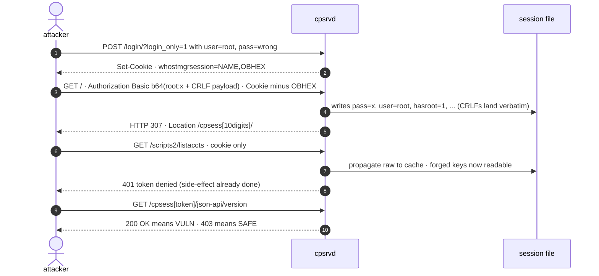

<div align="center">

# SessionScribe - CVE-2026-41940

**Critical unauthenticated RCE in cPanel & WHM.**
Four HTTP requests forge a root session via CRLF injection into the
password field of a preauth session.
No auth, no preconditions, every supported tier affected.
Disclosed 2026-04-28 by Sina Kheirkhah / [watchTowr Labs](https://labs.watchtowr.com/).

<a href="https://rfxn.com/research/cpanel-sessionscribe-cve-2026-41940"></a>

[](https://support.cpanel.net/hc/en-us/articles/40073787579671)
[](#priority-order)
[](https://support.cpanel.net/hc/en-us/articles/40073787579671)
[](LICENSE)

[Tools](#tools) · [The chain](#the-chain) · [Verify](#verify-yourself) · [Each tool](#each-tool) · [Fleet usage](#fleet-usage) · [Affected builds](#affected-builds) · [Priority order](#priority-order) · [Reporting](#reporting) · [References](#references)

</div>

<p align="center">
<strong><em>Four requests forge a root session. Six tiers still have no in-place patch.<br/>
The architectural fix isn't in the binary - it's at the proxy endpoint.</em></strong>
</p>

---

This repo is the operator-side toolkit: a phased mitigation orchestrator
that holds across patched and unpatched tiers, ModSec rules that work
today, a non-destructive remote probe for fleet sweeps, an on-host IOC
scanner, and the patch-diff snapshot collector behind the
[research article](https://rfxn.com/research/cpanel-sessionscribe-cve-2026-41940).

```bash
# audit a single host (read-only)
curl -fsSLO https://raw.githubusercontent.com/rfxn/cpanel-sessionscribe/main/sessionscribe-mitigate.sh
bash sessionscribe-mitigate.sh

# full remediation
bash sessionscribe-mitigate.sh --apply

# fleet roll-up - one CSV row per host (host, os, cpanel_version, ...)
bash sessionscribe-mitigate.sh --csv
```

> [!IMPORTANT]
> **Tiers 112, 114, 116, 120, 122, 128 have no vendor patch.** Every
> build on those tiers is vulnerable, and upgrade-or-migrate is the only
> durable fix. Until then: firewall TCP/2082, 2083, 2086, 2087, 2095, 2096
> to management CIDRs (the orchestrator's `csf`/`apf`/`runfw` phases do this
> on `--apply`) and front the remaining surface with the ModSec rule pack.

> [!NOTE]
> **The primitive in one paragraph.** CRLF injected into the `pass=` line
> of a preauth session splits the single line into multiple `key=value`
> lines on disk. Set `user=root`, `hasroot=1`, and
> `successful_internal_auth_with_timestamp`, and you've forged a
> root-authenticated session plus a working `cpsess` token. The
> [research article](https://rfxn.com/research/cpanel-sessionscribe-cve-2026-41940)
> covers the patch dissection, the two composing asymmetries
> (`filter_sessiondata` not on every write path; encoder short-circuits
> on missing `ob_part`), and the architectural argument for proxy-endpoint
> enforcement.

---

## Tools

Six artifacts in the kit. Click a name to jump to its quickstart + reference.

- **[`sessionscribe-mitigate.sh`](#sessionscribe-mitigatesh---mitigation-orchestrator)** - mitigation orchestrator *(on the cPanel host)*
- **[`modsec-sessionscribe.conf`](#modsec-sessionscribeconf---modsecurity-rule-pack)** - ModSecurity rule pack *(Apache + mod_security2, in front of cpsrvd)*
- **[`sessionscribe-remote-probe.sh`](#sessionscribe-remote-probesh---non-destructive-verdict-per-host)** - non-destructive remote probe *(anywhere with `curl`)*
- **[`sessionscribe-ioc-scan.sh`](#sessionscribe-ioc-scansh---on-host-ioc-ladder)** - on-host IOC ladder *(on the cPanel host)*
- **[`sessionscribe-forensic.sh`](#sessionscribe-forensicsh---kill-chain-reconstruction--evidence-bundle)** - kill-chain reconstruction + evidence bundle *(on the cPanel host)*
- **[`sessionscribe-revsnap.sh`](#sessionscribe-revsnapsh---re-snapshot-collector)** - per-tier RE snapshot collector *(on the cPanel host, around `upcp`)*

All artifacts live in this repo on
[GitHub](https://github.com/rfxn/cpanel-sessionscribe) and are
`curl`-ready via the raw URLs shown in each section's quickstart. GPL v2.

---

## How this compares to public material

The vendor advisory documents the patch boundary; the watchTowr PoC
demonstrates the primitive. This toolkit fills the operator-side gaps
in between.

| Capability | Vendor advisory | watchTowr PoC | This toolkit |
|---|---|---|---|
| Patched-build list | yes | no | yes - incl. EL6 11.86.0.41, EL6/CL6 110.0.103, tier 124 + WP² 136.1.7 + EOL handling |
| Remote detection | no | partial - stage 1+2 only, false-positives on patched hosts | full 4-stage chain, deterministic verdict |
| On-host IOC scan | partial | no | vendor patterns + co-occurrence + forged-timestamp heuristic |
| Active mitigation | "patch + reboot" | n/a | mitigation orchestrator + ModSec rules + port lockdown |
| Patch-dissection collateral | no | no | per-tier RE snapshot collector |

---

## The chain

Four HTTP requests, no auth, no preconditions:



Verdict is the HTTP code at request 4. The on-disk session file at
`/var/cpanel/sessions/raw/<sessname>` is the only post-hoc forensic
artifact. `sessionscribe-remote-probe.sh` runs this chain non-destructively
(canary-tagged session, no state-changing API calls, active logout);
`sessionscribe-ioc-scan.sh` reads the artifact directly.

---

## Verify yourself

Sixty-second smoke check on any Linux host (no cPanel required):

```bash
curl -fsSLO https://raw.githubusercontent.com/rfxn/cpanel-sessionscribe/main/sessionscribe-mitigate.sh
bash sessionscribe-mitigate.sh --list-phases    # surface the phase API
bash sessionscribe-mitigate.sh --check          # safe read-only audit
echo "exit=$?"                                  # 0 on a non-cPanel host
```

The orchestrator detects a non-cPanel host and exits clean - proving
idempotency without needing a lab. Hosts with `/var/cpanel/` present run
the full audit.

---

## How we got here

The first useful question after a security release is *what changed*. With
cPanel that is harder than it sounds. `cpsrvd` is a launcher/payload pair of
stripped ELF binaries with URL routing, login form parsing, and token
validation split across them; the Perl tree under `/usr/local/cpanel/Cpanel/`
and `Whostmgr/` carries the high-level handlers, but for this class of bug
the actual fix surface is compiled. There is no source release. To work the
diff, you have to capture the binaries pre and post upgrade and reason from
strings, dynsym, and disassembly outward.

That collector is `sessionscribe-revsnap.sh`. It produces a self-contained
tarball per tier so you can diff binaries, strings, and Perl source across
versions. From there the primitive falls out cleanly.

The primitive is **two asymmetries that compose**:

1. **`filter_sessiondata` is not on every write path.** `Cpanel::Session::create()`
   (the `/login/` form path) calls `filter_sessiondata()`, which strips CR/LF
   from string values before they hit disk. `Cpanel::Session::saveSession()`
   (the path used when an `Authorization: Basic` request lands on an
   existing session) does not. Anything written via `saveSession()` lands on
   disk verbatim.

2. **The encoder short-circuits on a missing `ob_part`.** The `whostmgrsession`
   cookie's canonical shape is `:NAME,OBHEX`. The OBHEX tail seeds the
   encoder for the `pass` field. `get_ob_part()` extracts it via the regex
   `s/,([0-9a-f]{1,64})$//`. Five cookie shapes fail this regex (no comma,
   trailing comma, non-hex tail, uppercase hex, hex tail >64 chars). When it
   fails, `$ob` stays undefined and `my $encoder = $ob && Encoder->new(...)`
   short-circuits - `$encoder` is false, the next-line `$encoder->encode_data`
   never runs, and `pass` is written through verbatim.

Compose them: with the encoder skipped *and* `saveSession()` not filtering, a
password supplied via `Authorization: Basic` is written to the on-disk
session file character for character. CR/LF inside the password splits the
single `pass=` line into multiple `key=value` lines. cpsrvd reads them back
as canonical session attributes. Set `successful_internal_auth_with_timestamp`,
`user=root`, and `hasroot=1`, and you have forged a logged-in root session.
The vendor advisory and watchTowr writeup document the request chain that
lands the resulting `cpsess` token.

The patch hex-encodes the whole `pass` value when ob_part is missing
(`pass=no-ob:<hex>`) and adds a companion `no-ob:` decode branch on the read
side. CR and LF become ASCII hex, the value can no longer split into
standalone `key=value` lines, and the invariant is encoded in the data
rather than in a single function call.

The full reverse-engineering walkthrough - including the auth-strings diff,
the 134-tier byte-identical-strings problem, and what we learned about the
adjacent identity-injection issue - is in the
[research article](https://rfxn.com/research/cpanel-sessionscribe-cve-2026-41940).

---

## Each tool

### `sessionscribe-mitigate.sh` - mitigation orchestrator

```bash
curl -fsSL https://raw.githubusercontent.com/rfxn/cpanel-sessionscribe/main/sessionscribe-mitigate.sh | bash
```

**Common patterns:**

```bash
# read-only audit (default)
bash sessionscribe-mitigate.sh

# full remediation - idempotent, re-run on a healthy host is a no-op
bash sessionscribe-mitigate.sh --apply

# narrow scope
bash sessionscribe-mitigate.sh --apply --only modsec --probe
bash sessionscribe-mitigate.sh --only patch,preflight     # pre-upcp gate

# fleet roll-up
bash sessionscribe-mitigate.sh --jsonl > host.jsonl
bash sessionscribe-mitigate.sh --csv   > host.csv
```

<details>
<summary><b>Phases reference + full <code>--help</code></b> (click to expand)</summary>

| Phase | What it does |
|---|---|
| `patch` | `cpanel -V` vs the published patched-build list (incl. EL6 11.86.0.41, EL6/CL6 110.0.103, tier 124, and WP² 136.1.7) |
| `preflight` | Removes `/etc/yum.repos.d/threatdown.repo`; ensures `epel-release`; disables broken non-base repos so `upcp` doesn't die mid-flight |
| `upcp` | If unpatched, kicks off `/scripts/upcp --force --bg` |
| `proxysub` | Enables `proxysubdomains` + new-account variant; rebuilds httpd conf |
| `csf` / `apf` / `runfw` | Strips cpsrvd ports (2082/2083/2086/2087/2095/2096) from `TCP_IN`/`TCP6_IN`/`IG_TCP_CPORTS`; verifies live iptables INPUT chain |
| `apache` | `httpd` running + `security2_module` loaded |
| `modsec` | `modsec2.user.conf` contains rules `1500030` + `1500031`; deploy if missing (timestamped backup, `httpd -t` validation, graceful reload) |
| `probe` (opt-in) | Runs `sessionscribe-remote-probe.sh` against `127.0.0.1` to confirm denials in practice |

Mutations write timestamped backups under
`/var/cpanel/sessionscribe-mitigation/` before touching any file. CentOS /
Alma / Rocky base/appstream/extras/updates/powertools repos are *never*
disabled by the preflight sweep, even if currently unreachable.

```
sessionscribe-mitigate.sh v0.2.1
Defense-in-depth active mitigation for CVE-2026-41940 (SessionScribe).

USAGE
    sessionscribe-mitigate.sh [MODE] [PHASE-SELECTION] [OUTPUT] [MISC]

    Read-only by default (--check). Use --apply to mutate state. All
    enabled phases run in order unless restricted via --only or excluded
    via --no-PHASE. Idempotent: re-running on a healthy host is a no-op.

MODES
    --check                Read-only audit (default). No state changes.
    --apply                Execute remediations. Requires root.
    --dry-run              Alias for --check.

PHASE SELECTION
    --only LIST            Run only the named phases (CSV, or "all").
                           Phases: patch,preflight,upcp,proxysub,csf,apf,runfw,apache,modsec,probe
    --no-PHASE             Skip a phase. Per-phase opt-outs:
                             --no-patch     --no-preflight   --no-upcp
                             --no-proxysub  --no-csf         --no-apf
                             --no-runfw     --no-apache      --no-modsec
    --no-fw                Shorthand for --no-csf --no-apf --no-runfw.
    --probe                Enable the optional probe phase (opt-in).
                           Runs sessionscribe-remote-probe.sh against
                           127.0.0.1:2087; expects SAFE/blocked verdict.
    --list-phases          Print phase IDs + descriptions, then exit.

OUTPUT (mutually exclusive on stdout - last flag wins)
    (default)              ANSI sectioned report on stderr.
    --json                 Single JSON envelope on stdout.
    --jsonl                Stream one JSON signal per line on stdout. Every
                           line carries host, os, cpanel_version, ts,
                           tool_version, mode, phase, severity, key, note.
    --csv                  Single CSV summary row on stdout (header + one
                           data row). One row per host - designed for
                           fleet roll-up via cat *.csv | awk ...
    -o, --output FILE      Write final JSON envelope (or CSV row if --csv
                           is set) to FILE.

MISC
    --quiet                Suppress sectioned report. Auto-set by --jsonl/--csv.
    --no-color             Disable ANSI color. NO_COLOR=1 env also honored.
    --backup-root DIR      Backup directory for any mutation
                           (default: /var/cpanel/sessionscribe-mitigation).
    --yes, -y              Non-interactive; assume yes (no prompts).
    -h, --help             Show this help.

EXIT CODES
    0    clean - patched + posture ok, no action needed
    1    remediation applied successfully (--apply made changes)
    2    manual intervention required (warns in --check, or fail in --apply)
    3    tool error (bad args, missing dependencies, not root for --apply)
```

</details>

### `modsec-sessionscribe.conf` - ModSecurity rule pack

```bash
curl -fsSL https://raw.githubusercontent.com/rfxn/cpanel-sessionscribe/main/modsec-sessionscribe.conf | sudo tee /etc/apache2/conf.d/modsec/modsec2.user.conf >/dev/null
sudo apachectl -t && sudo /usr/local/cpanel/scripts/restartsrv_httpd
```

**Common patterns:**

```bash
# fresh install - modsec2.user.conf is empty by default, replace it
curl -fsSL https://raw.githubusercontent.com/rfxn/cpanel-sessionscribe/main/modsec-sessionscribe.conf \
    | sudo tee /etc/apache2/conf.d/modsec/modsec2.user.conf >/dev/null

# append to an existing user.conf instead of replacing
curl -fsSL https://raw.githubusercontent.com/rfxn/cpanel-sessionscribe/main/modsec-sessionscribe.conf -o /tmp/ss.conf
sed -n '/^# === RULES ===/,$p' /tmp/ss.conf \
    | sudo tee -a /etc/apache2/conf.d/modsec/modsec2.user.conf

# edit the @ipMatch trust list at the top, then validate + reload
sudo $EDITOR /etc/apache2/conf.d/modsec/modsec2.user.conf
sudo apachectl -t
sudo /usr/local/cpanel/scripts/restartsrv_httpd
```

<details>
<summary><b>Rules reference + deployment notes</b> (click to expand)</summary>

| Rule | Surface | Action |
|---|---|---|
| `1500030` | CRLF inside `Authorization: Basic` decoded payload | deny, all sources, all paths |
| `1500031` | `whostmgrsession` cookie missing valid `,OBHEX` suffix | deny (defense-in-depth) |
| `1500010` | `Authorization: WHM` on `/json-api/`, `/execute/`, `/acctxfer*/` | deny when source not in trust list |
| `1500020` | `Authorization: WHM` on WebSocket dispatch family | deny when source not in trust list |
| `1500021` | `Authorization: WHM` on SSE dispatch path | deny when source not in trust list |

ID range reserved is `1500000–1500099`. Every deny runs in phase 1 - the
request never reaches the body inspector. Rule 1500030 base64-decodes the
`Authorization: Basic` payload and rejects on CR/LF in the decoded bytes;
no legitimate Basic-auth value decodes to bytes with newlines, so it has
no trust-list bypass. The WHM-token rules use `@ipMatch` against an
operator-defined trust list - edit the CIDRs at the top of the file
before deploying.

> [!IMPORTANT]
> These rules run inside Apache. `cpsrvd` listens directly on
> 2082/2083/2086/2087/2095/2096 and is reachable independent of Apache.
> **Pair the rule pack with cpsrvd-port firewalling to management CIDRs.**
> The [research article](https://rfxn.com/research/cpanel-sessionscribe-cve-2026-41940#going-forward)
> covers the proxy-endpoint posture.

</details>

### `sessionscribe-remote-probe.sh` - non-destructive verdict per host

```bash
curl -fsSL https://raw.githubusercontent.com/rfxn/cpanel-sessionscribe/main/sessionscribe-remote-probe.sh | bash -s -- --target 1.2.3.4
```

**Common patterns:**

```bash
# single host, default WHM-SSL ports
bash sessionscribe-remote-probe.sh --target 1.2.3.4

# Apache proxy test - whm./cpanel./webmail.example.com via 443 + 80
bash sessionscribe-remote-probe.sh --target 1.2.3.4 --proxy example.com

# fleet - quiet, exit 2 on any VULN
bash sessionscribe-remote-probe.sh --target 1.2.3.4 --quiet --no-color

# fleet - CSV across many targets
bash sessionscribe-remote-probe.sh --csv \
    $(awk '{print "--target "$1}' fleet.txt) > fleet.csv

# fast scoping - banner-only fingerprint, no session minted
bash sessionscribe-remote-probe.sh --target 1.2.3.4 --fingerprint-only

# clean canary sessions on a target after a run
bash sessionscribe-remote-probe.sh --cleanup
```

<details>
<summary><b>Detection chain + full <code>--help</code></b> (click to expand)</summary>

The probe runs the four-stage chain non-destructively: mint preauth → CRLF
inject → propagate raw→cache → verify via `/json-api/version`, then
actively logs out. Verdict-determining signal is the HTTP code at stage 4:
`200`, or `5xx` with a license body, is **VULN**; `401` or `403` is
**SAFE**. Every test session is tagged with an `nxesec_canary_<nonce>`
attribute for forensic cleanup, and **no state-changing API calls are
made**. Forged sessions are root-equivalent for ~1–3s between stage 3 and
stage 5 logout - see the script header for the full safety model.

```
sessionscribe-remote-probe.sh v1.2.2 - detection probe for CVE-2026-41940 (SessionScribe)

Usage:
  sessionscribe-remote-probe.sh --target HOST [--port PORT] [--scheme https|http] [--host-header NAME]
  sessionscribe-remote-probe.sh --target HOST --proxy DOMAIN
  sessionscribe-remote-probe.sh --target HOST --all
  sessionscribe-remote-probe.sh --target HOST1 --target HOST2 ...
  cat hosts.txt | sessionscribe-remote-probe.sh --                                    # batch via stdin

Targeting:
  --target HOST            IP, hostname, or [::1] for IPv6 (repeatable)
  --port PORT              Direct cpsrvd port (default WHM ports if not set)
  --scheme https|http      Default https
  --host-header NAME       Override Host: header
  --proxy DOMAIN           Test {whm,cpanel,webmail}.DOMAIN via 443 + 80
  --all                    Exhaustive sweep - all 6 cpsrvd direct ports
                           (cPanel/Webmail probes are informational only;
                            see "Known limitation" in the script header)
  --auto-host-discover     Pre-probe /openid_connect/cpanelid for canonical Host

Output modes (mutually exclusive - last one wins):
  (default)                Pretty per-probe output + summary
  -q | --quiet             Only print [VULN] hits and the final verdict line
  --oneline                One verdict line per target ("HOST: VULN n=2")
  --csv                    CSV header + one row per probe
  --json                   Structured JSON with probe results + per-target rollup
  --no-color               Disable ANSI color (also honored if env NO_COLOR=1)
  --no-progress            Suppress progress lines on multi-target runs
  --no-verify              Stage-2-only mode (v1 heuristic - NOTE: produces
                           FALSE POSITIVES on patched hosts).
  --fingerprint-only       Stage 0 only - harvest cpsrvd build banner +
                           cPanel_magic_revision and derive verdict from the
                           embedded patch-boundary table. Side-effect-free
                           (no session minted). Banner-only verdicts are
                           LOWER CONFIDENCE than the full chain; use for
                           fast scoping at fleet scale.
  --cleanup                Print the local cleanup command (matches all past
                           probe canaries: nxesec_canary_*) and exit. No
                           probing performed.

Tuning:
  --timeout N              Per-request timeout seconds (default 10)
  --connect-timeout N      TCP connect timeout (default 5)

Exit codes:
  0  no vulnerable targets found
  1  inconclusive results only (no VULN, but at least one INCONCLUSIVE)
  2  one or more VULN targets found

Detection mechanism (full chain - default):
  Stage 0   GET /login/?login_only=1   passive fingerprint, no session
  Stage 1   POST /login/?login_only=1  mint preauth cookie
  Stage 2   GET / + Authorization Basic CRLF payload + ob-stripped cookie
  Stage 3   GET /scripts2/listaccts    cookie only, propagate raw→cache
  Stage 4   GET /cpsess.../json-api/version  → 200=VULN, 5xx+License=VULN, 401/403=SAFE
  Stage 5   GET /cpsess.../logout + GET /logout - best-effort invalidate
```

</details>

### `sessionscribe-ioc-scan.sh` - on-host IOC ladder

```bash
curl -fsSL https://raw.githubusercontent.com/rfxn/cpanel-sessionscribe/main/sessionscribe-ioc-scan.sh | bash
```

**Common patterns:**

```bash
# default triage (detection only — fast, fleet sweep)
bash sessionscribe-ioc-scan.sh

# full kill-chain reconstruction inline (detection + forensic phases)
bash sessionscribe-ioc-scan.sh --full

# full kill-chain + intake bundle submission
bash sessionscribe-ioc-scan.sh --full --upload

# replay forensic phases against a saved envelope (re-render without re-scanning)
bash sessionscribe-ioc-scan.sh --replay /var/cpanel/sessionscribe-ioc/<run_id>.json
bash sessionscribe-ioc-scan.sh --replay /root/.ic5790-forensic/<bundle-dir>
bash sessionscribe-ioc-scan.sh --replay /root/.ic5790-forensic/<bundle>.tgz

# JSONL for SIEM ingest
bash sessionscribe-ioc-scan.sh --jsonl --quiet > host.jsonl

# CSV summary for fleet roll-up
bash sessionscribe-ioc-scan.sh --csv --quiet > host.csv

# host IOCs only - periodic post-patch sweep, last 7 days
bash sessionscribe-ioc-scan.sh --ioc-only --since 7

# offline forensics on an extracted snapshot tarball
bash sessionscribe-ioc-scan.sh \
    --root /tmp/cpanel-122.0.17/usr/local/cpanel \
    --version-string '11.122.0.17' \
    --cpsrvd-path /tmp/cpanel-122.0.17/usr/local/cpanel/cpsrvd
```

<details>
<summary><b>Checks reference + verdict axes + full <code>--help</code></b> (click to expand)</summary>

| Check | What it does |
|---|---|
| `version` | `cpanel -V` vs the published patched-build list - drives `code_verdict` |
| `static-pattern` | Greps `Cpanel/Session/*.pm` for post-patch sentinel patterns (`no-ob:` decode branch) |
| `cpsrvd-fingerprint` | cpsrvd binary inspection against patched-build signatures |
| `access-log` | Apache + cpsrvd logs for exploitation traffic shapes (`--no-logs` to skip) |
| `session-store` | `/var/cpanel/sessions/raw/` walk: vendor IOCs + 4-way co-occurrence + forged-timestamp heuristic (`--no-sessions` to skip) |
| `destruction` | Patterns A–G probes: `/root/sshd` encryptor, mysql-wipe, BTC index, `nuclear.x86`, `sptadm` reseller, `__S_MARK__` harvester, suspect SSH keys (`--no-destruction-iocs` to skip) |
| `probe` (opt-in) | Single marker GET to `127.0.0.1:2087` - confirms cpsrvd is responsive. Does **not** attempt the bypass |

Two verdict axes report independently. **`code_verdict`** (`PATCHED` /
`VULNERABLE` / `INCONCLUSIVE`) comes from version, Perl source patterns,
and binary fingerprint. **`host_verdict`** (`CLEAN` / `SUSPICIOUS` /
`COMPROMISED`) comes from the session-file IOC ladder, access-log scan,
and Patterns A–G destruction probes. Sessions tagged by the remote
probe's `nxesec_canary_<nonce>` are bucketed as `PROBE_ARTIFACT` and do
not escalate to `COMPROMISED`.

Exit codes (highest priority wins): `0` = PATCHED + CLEAN, `1` =
VULNERABLE, `2` = INCONCLUSIVE, `3` = tool error, `4` = COMPROMISED. A
patched host can still exit `4` if prior exploitation left IOCs on disk.

A run ledger is written to `/var/cpanel/sessionscribe-ioc/` by default
(`--no-ledger` to disable). `--full` runs forensic phases inline in the
same process. `--chain-forensic`, `--chain-on-critical`, `--chain-upload`
are preserved as v1.x back-compat aliases (map to `--full` + gate flags).

```
Usage: bash sessionscribe-ioc-scan.sh [OPTIONS]

Scan options:
      --probe                Send a single marker GET to 127.0.0.1:2087
                             (does not attempt the bypass - confirms cpsrvd
                             is responsive and access logs are flowing).
      --no-logs              Skip access-log IOC scan.
      --no-sessions          Skip session-store IOC + anomaly scan.
      --no-destruction-iocs  Skip destruction-stage probes (Patterns A-G:
                             /root/sshd encryptor, mysql-wipe, BTC index,
                             nuclear.x86, sptadm reseller, __S_MARK__
                             harvester, suspect SSH keys). Use for the
                             original-shape ioc-scan triage when only
                             session/log signals are wanted.
      --ioc-only             Run only the host-state IOC scans (logs +
                             sessions + destruction probes + optional
                             marker probe). Skip version, static-pattern,
                             and cpsrvd-binary code-state checks. The
                             code_verdict is reported as SKIPPED; the exit
                             code reflects host_verdict only. Useful for
                             periodic post-patch sweeps.
      --exclude-ip CIDR      Suppress attacker-IP cross-ref hits for this
                             address (single IP only - no CIDR mask
                             matching). Repeatable. Use for operator scan
                             boxes / known-good IR sources.
      --since DAYS           Limit log + session-anomaly scans to last N days.
                             Default: no filter (scan all retained data).
                             Vendor session IOCs (token-injection / preauth-
                             extauth / tfa / multiline-pass) always scan the
                             full /var/cpanel/sessions/raw/ regardless.

Snapshot-testing overrides (offline forensics on extracted tarballs):
      --root DIR             Override /usr/local/cpanel.
      --version-string S     Override `cpanel -V` output.
      --cpsrvd-path P        Override cpsrvd binary path.

Output:
  -o, --output FILE          Write structured output to FILE. Format follows
                             the streaming flag in effect: CSV when --csv
                             is set, JSON otherwise (default).
      --jsonl                Stream JSONL on stdout (one signal per line,
                             each prefixed with host=<fqdn> for fleet
                             aggregation). Suppresses sectioned report.
      --csv                  Stream per-host summary CSV on stdout (one
                             header row + one data row). Designed for fleet
                             roll-up: pipe many hosts through `awk 'NR==1
                             || FNR>1'` or import into SQL/Excel. Mutually
                             exclusive with --jsonl. Suppresses sectioned
                             report.
      --quiet                Suppress sectioned report.
      --no-color             Disable ANSI color codes.

Run ledger (default ON):
      --no-ledger            Skip the /var/cpanel/sessionscribe-ioc/ run
                             ledger. Use on hosts where you must not
                             leave residue.
      --ledger-dir DIR       Override default ledger directory
                             (/var/cpanel/sessionscribe-ioc/).
      --syslog               Emit a one-line summary via logger -t
                             sessionscribe-ioc -p auth.notice on completion.

Forensic modes (v2.0.0+):
      --full                 Run detection then forensic phases inline:
                             defense / offense / reconcile / kill-chain /
                             bundle. Writes envelope before forensic phases
                             so --full and --replay share the same read path.
      --replay PATH          Skip detection; replay forensic phases against
                             a saved envelope (.json), bundle directory, or
                             bundle tarball (.tgz). PATH resolution:
                               1. .json file → read directly
                               2. directory → scan for ioc-scan-envelope.json
                               3. .tgz/.tar.gz → extract to tmpdir, scan
      --no-bundle            Skip artifact tarball capture (use in --full or
                             --replay mode on Pattern A hosts or for fast
                             kill-chain re-render).
      --chain-forensic       Back-compat alias for --full (no host-verdict gate).
      --chain-on-critical    Back-compat alias for --full with
                             CHAIN_ON_CRITICAL=1 (skips forensic if
                             HOST_VERDICT != COMPROMISED).
      --chain-upload         Back-compat alias for --full --upload.

Misc:
      --timeout N            Probe timeout in seconds (default 8).
  -h, --help                 Show this help.

Exit codes: 0=PATCHED+CLEAN, 1=VULNERABLE, 2=INCONCLUSIVE, 3=tool error,
            4=COMPROMISED (host IOC hit - overrides patch verdict).
```

</details>

### `sessionscribe-forensic.sh` - deprecation shim (v0.99.0)

> [!WARNING]
> **`sessionscribe-forensic.sh` has been merged into `sessionscribe-ioc-scan.sh` v2.0.0.**
> The standalone forensic script is now a ~50-line deprecation shim. Use
> `sessionscribe-ioc-scan.sh --full` or `--replay` for new deployments.
> The shim will be removed in a future release.

The shim is preserved at the `sh.rfxn.com` and `raw.githubusercontent.com`
CDN URLs for operators still on the v1.x curl one-liner. It prints a one-line
deprecation notice (suppressed by `--quiet` or `--jsonl`) and delegates to
`sessionscribe-ioc-scan.sh --replay <envelope-path>`. The `--quiet` and
`--jsonl` flags are forwarded to the underlying script.

```bash
# Still works (shim delegates to ioc-scan --replay):
curl -fsSL https://raw.githubusercontent.com/rfxn/cpanel-sessionscribe/main/sessionscribe-forensic.sh | bash

# Preferred v2.0.0 equivalent — full kill-chain in one script:
curl -fsSL https://raw.githubusercontent.com/rfxn/cpanel-sessionscribe/main/sessionscribe-ioc-scan.sh | bash -s -- --full

# Replay a saved envelope (re-render kill-chain without re-scanning):
bash sessionscribe-ioc-scan.sh --replay /var/cpanel/sessionscribe-ioc/<run_id>.json
bash sessionscribe-ioc-scan.sh --replay /root/.ic5790-forensic/<bundle-dir>
bash sessionscribe-ioc-scan.sh --replay /root/.ic5790-forensic/<bundle>.tgz
```

<details>
<summary><b>Phases + verdicts + bundle layout (now in ioc-scan --full / --replay)</b> (click to expand)</summary>

The forensic phases (previously in `sessionscribe-forensic.sh`) now run
inline inside `sessionscribe-ioc-scan.sh` when `--full` or `--replay` is
passed. Phase behavior is identical; see the `sessionscribe-ioc-scan.sh`
section above for the `--full` / `--replay` flag reference.

| Phase | What it does |
|---|---|
| `defense` | Extract timestamps for every defense layer that landed: cpanel patch (`Load.pm` mtime), cpsrvd restart-after-patch, `sessionscribe-mitigate.sh` runs, ModSec rule 1500030/1500031 install, CSF/APF cpsrvd port closures, proxysub enable, `upcp` summary log |
| `offense` | Extract timestamps for every observed compromise indicator: forged sessions (Pattern X), `sptadm` reseller / `WHM_FullRoot` tokens (Pattern D), websocket Shell + Fileman API harvest (Pattern E), automated harvester shell envelope (Pattern F), SSH-key persistence (Pattern G), `.sorry` encryptor + `/root/sshd` (Pattern A), BTC ransom drop + `/var/lib/mysql/mysql` wipe (Pattern B), `nuclear.x86` + flameblox C2 (Pattern C) |
| `reconcile` | Per-indicator: was the relevant defense active when the indicator first appeared? Output: **PRE-DEFENSE** \| **POST-DEFENSE** \| **POST-PARTIAL** \| **UNDEFENDED**, plus time delta to the relevant defense activation |
| `bundle` | Tarball of raw artifacts: sessions (raw+preauth), access logs (cpanel + apache + cpsrvd), system auth logs, cpanel control-plane state, per-account state, persistence (ssh keys, cron-all, systemd, sudoers + drop-in, root histories), defense state, ps/ss/iptables snapshot |

PRE-DEFENSE = host was open to the exploit when the indicator landed;
POST-DEFENSE = the indicator is collateral or pre-mitigation noise.

**Bundle layout** (per host, under `/root/.ic5790-forensic/<TS>-<RUN_ID>/`,
mode `0700`):

```
manifest.txt              host/uid/cpv/run_id/window/cap
sessions.tgz              /var/cpanel/sessions/{raw,preauth} (filtered)
access-logs.tgz           cpsrvd access + incoming_http_requests + error_log
                          + global Apache access/error (NO domlogs)
system-logs.tgz           /var/log/{secure,messages,audit/audit.log,auth.log}*
cpanel-state.tgz          accounting.log + resellers + cpanel.config + api_tokens_v2
cpanel-users.tgz          /var/cpanel/users/ (split out, per-account state)
persistence.tgz           ssh keys + all cron tiers + systemd/init.d/profile.d
                          + rc.local + root histories + passwd/group
                          + sudoers + sudoers.d/  (NO /etc/shadow)
defense-state.tgz         mitigate backups + csf/apf/modsec configs + updatelogs
ps.txt                    `ps auxfww`
connections.txt           `ss -tnp` (or netstat fallback)
iptables.txt              `iptables -L -nv`
pattern-a-binary-metadata.txt   only if /root/sshd present (metadata; binary NOT bundled)
user-histories/           per-user .bash_history (gated on --no-history)
```

Typical bundle on a busy cPanel host with the 90-day window: ~250 MB –
2 GB compressed. Per-tarball 2 GB cap (`--max-bundle-mb`) drops oversize
candidates individually so the rest of the bundle still lands.

</details>

### Deprecation: sessionscribe-forensic.sh

As of v2.0.0, all forensic phases (defense timeline, kill-chain, bundle,
upload) are built into `sessionscribe-ioc-scan.sh`. The migration path:

| v1.x one-liner | v2.0.0 equivalent |
|---|---|
| `bash sessionscribe-forensic.sh` | `bash sessionscribe-ioc-scan.sh --full` |
| `bash sessionscribe-forensic.sh --no-bundle` | `bash sessionscribe-ioc-scan.sh --full --no-bundle` |
| `bash sessionscribe-forensic.sh --upload` | `bash sessionscribe-ioc-scan.sh --full --upload` |
| `SESSIONSCRIBE_IOC_JSON=<path> bash sessionscribe-forensic.sh` | `bash sessionscribe-ioc-scan.sh --replay <path>` |
| `bash sessionscribe-ioc-scan.sh --chain-forensic` | `bash sessionscribe-ioc-scan.sh --full` |
| `bash sessionscribe-ioc-scan.sh --chain-on-critical` | `bash sessionscribe-ioc-scan.sh --full` (CHAIN_ON_CRITICAL=1) |
| `bash sessionscribe-ioc-scan.sh --chain-upload` | `bash sessionscribe-ioc-scan.sh --full --upload` |

The `sessionscribe-forensic.sh` v0.99.0 shim is retained at both CDN URLs
(`sh.rfxn.com` and `raw.githubusercontent.com`) to avoid breaking deployed
one-liners during the grace period. The shim prints a deprecation notice
and execs into `ioc-scan --replay`. It will be removed in a future release.

### `sessionscribe-revsnap.sh` - RE snapshot collector

```bash
curl -fsSL https://raw.githubusercontent.com/rfxn/cpanel-sessionscribe/main/sessionscribe-revsnap.sh | bash
```

**Common patterns:**

```bash
# capture current tier (writes to /var/cpanel/sessionscribe-revsnap/)
bash sessionscribe-revsnap.sh

# upgrade and capture next tier - RE diff workflow
/scripts/upcp --force
bash sessionscribe-revsnap.sh

# alternate output dir
SNAPDIR=/path/to/snapshots bash sessionscribe-revsnap.sh
```

<details>
<summary><b>Tarball layout + behavior notes</b> (click to expand)</summary>

Each invocation produces one tarball + sha256, keyed off `cpanel -V`,
host, and timestamp. Captured collateral is built for BinDiff, Diaphora,
and plain text-diff workflows side by side.

```
cpanel-<ver>-<host>-<ts>/
├── binaries/                 cpsrvd, cpsrvd.so, cpanel, whostmgr, …
├── symbols/
│   ├── <bin>.strings         full strings dump
│   ├── <bin>.dynsym          nm -D
│   ├── <bin>.objdump-T       dynamic symbol table
│   ├── <bin>.readelf         full ELF metadata
│   ├── auth-strings/
│   │   ├── *.auth-strings.txt    auth|login|session|token|…
│   │   └── *.regex-candidates.txt PCRE-shaped strings
│   └── disasm/
│       └── *.objdump-d.gz    function-level disassembly
├── modules/
│   ├── Cpanel/{Auth,Session,Server,Cookies,…}
│   ├── Whostmgr/{Auth,Session,ACLS,…}
│   └── _so_files/            cpanel-only .so flattened
├── runtime/
│   ├── preauth-session-schema-sample.txt   anonymized baseline
│   ├── session-dir-layout.txt
│   └── cpsrvd-process-state.txt
└── meta/
    ├── full-tree-hashes.txt  sha256 of every .pm/.so/.pl/exec
    ├── rpms-cpanel-detailed.txt
    └── captured-collateral-rationale.txt
```

We publish this beyond SessionScribe because it generalizes: every future
cpsrvd CVE will land in roughly the same surface, and having a tarball
pair for the pre-patch and patched build is the difference between hours
and days of analysis.

</details>

---

## Fleet usage

> [!TIP]
> Every artifact emits structured output (`--json`, `--jsonl`, `--csv`)
> with `host`, `os`, `cpanel_version`, and `ts` on every record. Designed
> for `pdsh | jq` or `ansible -m script` roll-up across hundreds of hosts
> in one pass.

```bash
# pdsh + JSONL roll-up (mitigation posture)
pdsh -w cpanel-fleet 'bash -s -- --jsonl --quiet' < sessionscribe-mitigate.sh \
    | jq -c 'select(.severity != "info")' \
    > fleet-mitigate.jsonl

# remote probe sweep - exit 2 on any VULN
bash sessionscribe-remote-probe.sh --csv --quiet \
    $(awk '{print "--target "$1}' fleet.txt) > fleet-probe.csv
echo "any_vuln=$?"

# IOC scan via ssh, JSONL to SIEM
for h in $(cat fleet.txt); do
    ssh "$h" 'bash -s' < sessionscribe-ioc-scan.sh -- --jsonl --quiet
done | jq -c '.' > fleet-ioc.jsonl

# ansible script module + CSV merge
ansible -i hosts cpanel -m script -a 'sessionscribe-mitigate.sh --csv --quiet' \
    > fleet-mitigate.csv

# kill-chain reconciliation across fleet - --no-bundle on the broad sweep,
# then collect bundles only on the high-attention hosts (v2.0.0+: use --full)
ansible -i hosts cpanel -m script \
    -a 'sessionscribe-ioc-scan.sh --full --no-bundle --jsonl' > fleet-forensic.jsonl
jq -r 'select(.phase=="summary" and .key=="verdict"
              and .note=="COMPROMISED_PRE_DEFENSE") | .host' \
    fleet-forensic.jsonl > pre-defense-hosts.txt

# bundle collection on the pre-defense subset
ansible -i pre-defense-hosts.txt all -m script \
    -a 'sessionscribe-ioc-scan.sh --full --jsonl --bundle-dir /root/.ic5790-forensic'
```

The probe is independently fleet-safe (canary-tagged sessions, active
logout, no state-changing API calls). The on-host scripts respect
`--quiet` + structured-output flags so stdout is parser-clean.

---

## What this toolkit does NOT do

Explicit non-goals:

- **Not a vendor patch.** Does not modify `cpsrvd`, `cpsrvd.so`, or
  `Cpanel/Session/*.pm`. The cpanel-issued back-port for your tier is the
  real fix; the toolkit closes the practical attack window in the meantime
  and stays useful as detection + posture validation after the patch lands.
- **Not a fix for tiers 112, 114, 116, 120, 122, 128.** Those tiers
  have no vendor patch. The orchestrator's `proxysub` + firewall phases
  plus the ModSec rule pack reduce blast radius, but the only durable
  answer is upgrade or migration.
- **Not a replacement for port lockdown.** ModSec rules fire only on
  traffic that traverses Apache. `cpsrvd` listens directly on
  2082/2083/2086/2087/2095/2096 and is reachable independent of Apache.
  Pair the rule pack with cpsrvd-port firewalling.
- **Not exploit code.** The remote probe issues no state-changing API
  calls, tags every test session with an `nxesec_canary_<nonce>` attribute
  for forensic cleanup, and actively logs out at end-of-run. It approximates
  the chain to produce a deterministic verdict; it does not weaponize it.
- **Not an incident-response substitute.** `sessionscribe-ioc-scan.sh`
  finds artifacts of prior exploitation; it does not remediate them, hunt
  across hosts, or correlate with billing/customer data. Treat its
  `COMPROMISED` verdict as a trigger for full IR, not a conclusion.

---

## Indicators of compromise

Forged session-file shape (contents of `/var/cpanel/sessions/raw/<sessname>`
after exploitation):

```
local_port=2087
hasroot=1
hulk_registered=1
pass=x
origin_as_string=address=127.0.0.1,app=whostmgrd,method=badpass
token_denied=1
local_ip_address=127.0.0.1
external_validation_token=cS9C19OfV0hCA4uD
cp_security_token=/cpsess6844364556
ip_address=127.0.0.1
user=root
tfa_verified=1
successful_internal_auth_with_timestamp=9999999999
port=39040
login_theme=cpanel
```

A normal preauth session never contains `pass=`, `hasroot=1`, `user=root`,
`tfa_verified=1`, or `successful_internal_auth_with_timestamp=`. Any of
those combined with `origin_as_string=…method=badpass` is diagnostic. A
forged-timestamp value beyond `now+365d` (e.g. `9999999999`) is
independently diagnostic.

```bash
for f in /var/cpanel/sessions/raw/*; do
  [ -f "$f" ] || continue
  if grep -q '^token_denied=' "$f" \
     && grep -q '^cp_security_token=' "$f" \
     && grep -q '^origin_as_string=.*method=badpass' "$f"; then
    echo "IOC0 hit: $f"
  fi
done
```

Access-log signal: successful `200`/`302`/`307` responses on `/json-api/`,
`/execute/`, or `/scripts2/` paths from non-baseline source IPs without a
preceding `/login/` 200 in the same session window.

---

## Affected builds

```
11.86.0.41 (EL6/CL7)   11.110.0.97        11.118.0.63        11.124.0.35
11.126.0.54            11.130.0.19        11.132.0.29        11.134.0.20
11.136.0.5             110.0.103 (EL6/CL6 from .50)

WP Squared:            136.1.7
```

Tiers excluded from the vendor patch list have **no in-place fix**: 112,
114, 116, 120, 122, 128. Hosts on those tiers must be upgraded to a
patched major series, migrated, or have their cpsrvd listeners firewalled
until they are.

The 11.86.0.41 build for EL6/CL7 was added in the 04/29 advisory revision;
11.130 was bumped from `.18` to `.19` in the same revision. A subsequent
revision added **11.124.0.35** (closing the prior gap on tier 124) and
**110.0.103** as a direct upgrade target for EL6/CL6 hosts still on
v110.0.50, so they don't have to cross-tier jump to 11.86.

---

## Priority order

**Immediate**
- Patch to the build for your tier (above).
- If the tier has no patch, firewall TCP/2082, 2083, 2086, 2087, 2095, 2096
  to management CIDRs immediately. Plan an upgrade or migration.
- Run `sessionscribe-ioc-scan.sh` fleet-wide. A patched host can still be
  compromised.

**Forward**
- Enable proxy subdomains so cPanel/WHM/Webmail are reachable through
  Apache on 80/443.
- Deploy `modsec-sessionscribe.conf` into `modsec2.user.conf` with the
  `@ipMatch` trust list set.
- Firewall TCP/2082, 2083, 2086, 2087, 2095, 2096 to management CIDRs only.
  Apache + ModSecurity becomes the sole public ingress.
- Standardize this proxy-endpoint posture as the default. The next cpsrvd
  advisory will land on the same six ports.

The architectural case for proxy-endpoint enforcement - why we're treating
SessionScribe as the moment to stop shipping cpsrvd to the open internet,
and how to do it without breaking customer ingress - is the closing third
of the [research article](https://rfxn.com/research/cpanel-sessionscribe-cve-2026-41940#going-forward).

---

## Reporting

> [!TIP]
> **Found a bug, missed IOC, false positive, or have ops feedback?**
> [Open a GitHub issue](https://github.com/rfxn/cpanel-sessionscribe/issues/new) -
> bug reports, IOC variants seen in the wild, detection misses on
> patched/unpatched hosts, ModSec rule false positives, and general
> operator feedback are all welcome.
>
> Sensitive disclosures (live exploitation evidence, customer data, novel
> exploit chains not yet public) should go via
> [Keybase](https://keybase.io/rfxn) or [email](mailto:ryan@rfxn.com),
> not GH Issues.

---

## References

- **Research article (full writeup):** [rfxn.com/research/cpanel-sessionscribe-cve-2026-41940](https://rfxn.com/research/cpanel-sessionscribe-cve-2026-41940)
- **Vendor advisory:** [cPanel KB 40073787579671](https://support.cpanel.net/hc/en-us/articles/40073787579671)
- **Researcher writeup:** [watchTowr Labs](https://labs.watchtowr.com/)
- **Public PoC:** [watchtowrlabs/watchTowr-vs-cPanel-WHM-AuthBypass-to-RCE.py](https://github.com/watchtowrlabs/watchTowr-vs-cPanel-WHM-AuthBypass-to-RCE.py)
- **Source:** [github.com/rfxn/cpanel-sessionscribe](https://github.com/rfxn/cpanel-sessionscribe)

## License

GPL v2. See individual file headers.

---

*Forged during the SessionScribe incident response - Ryan MacDonald, R-fx Networks.*
