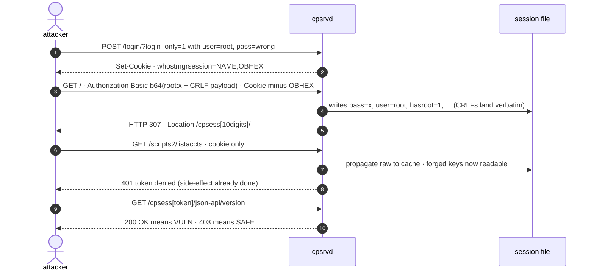

<div align="center">

# SessionScribe - CVE-2026-41940

**Critical unauthenticated RCE in cPanel & WHM.**
Four HTTP requests forge a root session via CRLF injection into the
password field of a preauth session.
No auth, no preconditions, every supported tier affected.
Disclosed 2026-04-28 by Sina Kheirkhah / [watchTowr Labs](https://labs.watchtowr.com/).

<a href="https://rfxn.com/research/cpanel-sessionscribe-cve-2026-41940"></a>

[](https://support.cpanel.net/hc/en-us/articles/40073787579671)
[](#priority-order)
[](https://support.cpanel.net/hc/en-us/articles/40073787579671)
[](LICENSE)

[Quickstart](#quickstart) · [ioc-scan](#sessionscribe-ioc-scansh---ioc-ladder--kill-chain) · [mitigate](#sessionscribe-mitigatesh---mitigation-orchestrator) · [remote-probe](#sessionscribe-remote-probesh---non-destructive-fleet-probe) · [Affected builds](#affected-builds) · [Priority order](#priority-order)

</div>

> [!IMPORTANT]
> **Tiers 112, 114, 116, 120, 122, 128 have no vendor patch.** Every
> build on those tiers is vulnerable; upgrade or migrate is the only
> durable fix. Until then: firewall TCP/2082, 2083, 2086, 2087, 2095, 2096
> to management CIDRs (`mitigate.sh --apply` does this) and front the
> remaining surface with the ModSec rule pack.

---

## Quickstart

Three commands, in operator priority order:

```bash
# 1. Are we already compromised?  (on-host IOC scan, fast triage)
curl -fsSLO https://raw.githubusercontent.com/rfxn/cpanel-sessionscribe/main/sessionscribe-ioc-scan.sh
bash sessionscribe-ioc-scan.sh

# 2. Close the window  (idempotent; firewalls cpsrvd ports, deploys ModSec, etc.)
curl -fsSLO https://raw.githubusercontent.com/rfxn/cpanel-sessionscribe/main/sessionscribe-mitigate.sh
bash sessionscribe-mitigate.sh --apply

# 3. Sweep the fleet from anywhere  (non-destructive remote verdict)
curl -fsSL https://raw.githubusercontent.com/rfxn/cpanel-sessionscribe/main/sessionscribe-remote-probe.sh \
    | bash -s -- --target HOST
```

Exit codes are designed for fleet automation: `ioc-scan` exits `4` on
COMPROMISED, `1` on VULNERABLE; `mitigate` exits `0` clean / `1` applied
/ `2` manual / `3` tool error; `remote-probe` exits `2` if any target is
VULN.

---

## Tools

In order of operational priority. Every artifact emits structured output
(`--json` / `--jsonl` / `--csv`) keyed on `host`, `os`, `cpanel_version`,
`ts` for fleet roll-up.

| Tool | Role | Where it runs |
|---|---|---|
| **[`sessionscribe-ioc-scan.sh`](#sessionscribe-ioc-scansh---ioc-ladder--kill-chain)** | First-class triage. IOC ladder, code-state + host-state verdicts, kill-chain reconstruction, IR bundle. | on the cPanel host |
| **[`sessionscribe-mitigate.sh`](#sessionscribe-mitigatesh---mitigation-orchestrator)** | Close the window. Phased mitigation: patch check, firewall, proxysub, ModSec. | on the cPanel host |
| **[`sessionscribe-remote-probe.sh`](#sessionscribe-remote-probesh---non-destructive-fleet-probe)** | Supporting collateral. Non-destructive 4-stage probe → VULN/SAFE per host. | anywhere with `curl` |
| [`modsec-sessionscribe.conf`](#supporting-collateral) | ModSec rule pack deployed by `mitigate`. | Apache front-end |
| [`sessionscribe-revsnap.sh`](#supporting-collateral) | Per-tier RE snapshot collector for binary diffing. | on the cPanel host, around `upcp` |

GPL v2. All artifacts `curl`-ready via the raw URLs above.

---

## `sessionscribe-ioc-scan.sh` - IOC ladder + kill-chain

**Run this first.** Detection-only by default (fast, fleet-friendly);
add `--full` to run the forensic phases inline (defense timeline, offense
ingest, reconcile, kill-chain renderer, IR bundle).

```bash
# fast triage  (detection only)
bash sessionscribe-ioc-scan.sh

# full kill-chain reconstruction inline
bash sessionscribe-ioc-scan.sh --full

# full + ship IR bundle to intake
bash sessionscribe-ioc-scan.sh --full --upload

# JSONL for SIEM ingest
bash sessionscribe-ioc-scan.sh --jsonl --quiet > host.jsonl

# host IOCs only - periodic post-patch sweep, last 7 days
bash sessionscribe-ioc-scan.sh --ioc-only --since 7

# replay forensic phases against a saved envelope (no re-scan)
bash sessionscribe-ioc-scan.sh --replay /var/cpanel/sessionscribe-ioc/<run_id>.json
```

### Verdicts

Two axes report independently. **`code_verdict`** (`PATCHED` /
`VULNERABLE` / `INCONCLUSIVE`) comes from version, Perl source patterns,
and cpsrvd binary fingerprint. **`host_verdict`** (`CLEAN` /
`SUSPICIOUS` / `COMPROMISED`) comes from the session-file IOC ladder,
access-log scan, and Patterns A–G destruction probes. **A patched host
can still exit `4` if prior exploitation left IOCs on disk.**

| Exit | Code-state    | Host-state   | Triage action |
|---|---|---|---|
| 0 | CLEAN/PATCHED | CLEAN | none |
| 1 | VULNERABLE | (any) | patch cpsrvd |
| 2 | INCONCLUSIVE | (any) | manual code-state review (also: tool error) |
| 3 | (any) | SUSPICIOUS | review session/access logs |
| 4 | (any) | COMPROMISED | full IR; bundle + upload |

Sessions tagged with `nxesec_canary_<nonce>` (left by the remote probe)
bucket as `PROBE_ARTIFACT` and do not escalate to `COMPROMISED`.

### Kill-chain output sample

`--full` collates every IOC against defense activations and classifies
each as **PRE-DEFENSE**, **POST-DEFENSE**, **POST-PARTIAL**, or
**UNDEFENDED**, then summarises with verdict + defense-lag headline.
PRE-DEFENSE = host was open to the exploit when the indicator landed;
POST-DEFENSE = collateral or pre-mitigation noise.

```
+-- CVE-2026-41940 / IC-5790 --------------------------------------------
| host         cpanel.example.com ()
| cpanel       unknown   os unknown
| verdict      COMPROMISED   score 315   ioc-scan v2.5.0
| defenses     patch x absent   modsec + up   csf + clean   mitigate + ran
+------------------------------------------------------------------------

  |  -- PRE-DEFENSE (32 events) --
  |  2026-03-25T09:43:19Z  ! pattern X     ioc_attacker_ip_2xx_on_cpsess         57 hit(s) (last 90d) from IC-5790 IPs returned 2xx on /cpsess<N>/ paths - real exploitation
  |  2026-04-28T14:35:56Z  ! pattern X     ioc_cve_2026_41940_crlf_access_chain  15 CRLF-bypass chain(s) — POST /login 401 then GET /cpsess<N> 2xx as root within 2s
  |  2026-04-28T16:38:45Z  ! pattern E     ioc_pattern_e_websocket_shell_hits    45 external IP(s) reached /cpsess*/websocket/Shell with 2xx
  |  2026-04-29T08:41:22Z  ! pattern F     ioc_pattern_f_smark_envelope          __S_MARK__/__E_MARK__ harvester envelope in /root/.bash_history
  |  2026-04-29T16:41:24Z  ! pattern A     ioc_pattern_a_ransom_readme           /home/user1/README.md
  |  …  (22 more Pattern A ransom_readme events across customer homedirs)
  |  2026-04-29T16:42:09Z  ! pattern A     ioc_pattern_a_sorry_files_present     608 .sorry-encrypted files present
  |  2026-04-29T17:52:58Z  ! pattern D     ioc_pattern_d_acctlog_encrypted       /var/cpanel/accounting.log.sorry

  |  -- DEFENSES --
  |  2026-04-29T23:48:21Z  + DEFENSE     mitigate_first          sessionscribe-mitigate.sh first run
  |  2026-04-29T23:48:21Z  + DEFENSE     csf                     csf.conf cpsrvd ports stripped
  |  2026-04-29T23:48:46Z  + DEFENSE     modsec                  modsec rule 1500030 installed

  |  -- POST-PARTIAL (1 event) --
  |  2026-04-30T12:23:42Z  ! pattern E     ioc_pattern_e_handoff_burst_present   3 distinct external IPs each minted cpsess + reached websocket Shell within 15-min window

  | HEADLINE
  |   verdict       COMPROMISED  (score 315)
  |   defense lag   37d 9h LATE  (first IOC 2026-03-25T09:43:19Z, defense up 37d 9h later)
```

<details>
<summary><b>Checks reference + forensic phases + bundle layout</b> (click to expand)</summary>

| Check | What it does |
|---|---|
| `version` | `cpanel -V` vs the published patched-build list - drives `code_verdict` |
| `static-pattern` | Greps `Cpanel/Session/*.pm` for post-patch sentinel patterns (`no-ob:` decode branch) |
| `cpsrvd-fingerprint` | cpsrvd binary inspection against patched-build signatures |
| `access-log` | Apache + cpsrvd logs for exploitation traffic shapes (`--no-logs` to skip) |
| `session-store` | `/var/cpanel/sessions/raw/` walk: vendor IOCs + 4-way co-occurrence + forged-timestamp heuristic (`--no-sessions` to skip) |
| `destruction` | Patterns A–G probes: `/root/sshd` encryptor, mysql-wipe, BTC index, `nuclear.x86`, `sptadm` reseller, `__S_MARK__` harvester, suspect SSH keys (`--no-destruction-iocs` to skip) |
| `probe` (opt-in) | Single marker GET to `127.0.0.1:2087` - confirms cpsrvd is responsive. Does **not** attempt the bypass |

**`--full` forensic phases** (run inline after detection):

| Phase | What it does |
|---|---|
| `defense` | Timestamps every defense layer that landed: cpanel patch, cpsrvd restart-after-patch, mitigate runs, ModSec rules, CSF/APF port closures, proxysub, `upcp` summary |
| `offense` | Timestamps every observed compromise indicator (Patterns A–G + Pattern X CRLF-bypass chain) |
| `reconcile` | Per-indicator: was the relevant defense active when it first appeared? PRE-DEFENSE / POST-DEFENSE / POST-PARTIAL / UNDEFENDED + time delta |
| `bundle` | Tarball of raw artifacts under `/root/.ic5790-forensic/<TS>-<RUN_ID>/`, mode `0700` |

**Bundle layout** (`/root/.ic5790-forensic/<TS>-<RUN_ID>/`):

```
manifest.txt              host/uid/cpv/run_id/window/cap
sessions.tgz              /var/cpanel/sessions/{raw,preauth} (filtered)
access-logs.tgz           cpsrvd access + incoming_http_requests + error_log
                          + global Apache access/error (NO domlogs)
system-logs.tgz           /var/log/{secure,messages,audit/audit.log,auth.log}*
cpanel-state.tgz          accounting.log + resellers + cpanel.config + api_tokens_v2
cpanel-users.tgz          /var/cpanel/users/ (split out, per-account state)
persistence.tgz           ssh keys + all cron tiers + systemd/init.d/profile.d
                          + rc.local + root histories + passwd/group + sudoers
defense-state.tgz         mitigate backups + csf/apf/modsec configs + updatelogs
ps.txt / connections.txt / iptables.txt
pattern-a-binary-metadata.txt   only if /root/sshd present (metadata; binary NOT bundled)
user-histories/           per-user .bash_history (gated on --no-history)
```

Typical bundle on a busy host with the 90-day window: ~250 MB – 2 GB compressed.
Per-tarball 2 GB cap (`--max-bundle-mb`) drops oversize candidates individually.

A run ledger is written to `/var/cpanel/sessionscribe-ioc/` by default
(`--no-ledger` to disable). `--chain-forensic` / `--chain-on-critical` /
`--chain-upload` are preserved as v1.x back-compat aliases.

Snapshot-testing overrides for offline forensics on extracted tarballs:
`--root DIR`, `--version-string S`, `--cpsrvd-path P`. See `--help` for
the full flag list.

</details>

---

## `sessionscribe-mitigate.sh` - mitigation orchestrator

Read-only by default (`--check`). Add `--apply` to mutate state.
Idempotent: re-running on a healthy host is a no-op. Mutations write
timestamped backups under `/var/cpanel/sessionscribe-mitigation/`
before touching any file.

```bash
# read-only audit (default)
bash sessionscribe-mitigate.sh

# full remediation
bash sessionscribe-mitigate.sh --apply

# narrow scope
bash sessionscribe-mitigate.sh --apply --only modsec --probe
bash sessionscribe-mitigate.sh --only patch,preflight     # pre-upcp gate

# fleet roll-up - one CSV row per host
bash sessionscribe-mitigate.sh --csv  > host.csv
bash sessionscribe-mitigate.sh --jsonl > host.jsonl
```

| Phase | What it does |
|---|---|
| `patch` | `cpanel -V` vs the published patched-build list (incl. EL6 11.86.0.41, EL6/CL6 110.0.103, tier 124, WP² 136.1.7) |
| `preflight` | Removes `/etc/yum.repos.d/threatdown.repo`; ensures `epel-release`; disables broken non-base repos so `upcp` doesn't die mid-flight |
| `upcp` | If unpatched, kicks off `/scripts/upcp --force --bg` |
| `proxysub` | Enables `proxysubdomains` + new-account variant; rebuilds httpd conf |
| `csf` / `apf` / `runfw` | Strips cpsrvd ports (2082/2083/2086/2087/2095/2096) from `TCP_IN`/`TCP6_IN`/`IG_TCP_CPORTS`; verifies live iptables INPUT chain |
| `apache` | `httpd` running + `security2_module` loaded |
| `modsec` | `modsec2.user.conf` contains rules `1500030` + `1500031`; deploy if missing (timestamped backup, `httpd -t` validation, graceful reload) |
| `probe` (opt-in) | Runs `sessionscribe-remote-probe.sh` against `127.0.0.1` to confirm denials in practice |

CentOS / Alma / Rocky base/appstream/extras/updates/powertools repos
are **never** disabled by `preflight`, even if currently unreachable.

### Exit codes

| Exit | Meaning |
|---|---|
| 0 | clean - patched + posture ok, no action needed |
| 1 | remediation applied successfully (`--apply` made changes) |
| 2 | manual intervention required (warns in `--check`, fails in `--apply`) |
| 3 | tool error (bad args, missing dependencies, not root for `--apply`) |

Phase selection: `--only LIST`, `--no-PHASE`, `--no-fw` (shorthand for
`--no-csf --no-apf --no-runfw`). Output: `--json` / `--jsonl` / `--csv`,
`-o FILE`. See `--help` for the full flag list.

### Sixty-second smoke check

```bash
bash sessionscribe-mitigate.sh --list-phases    # surface the phase API
bash sessionscribe-mitigate.sh --check          # safe read-only audit
echo "exit=$?"                                  # 0 on a non-cPanel host
```

The orchestrator detects a non-cPanel host and exits clean — proving
idempotency without needing a lab.

---

## `sessionscribe-remote-probe.sh` - non-destructive fleet probe

Supporting collateral. Runs the four-stage chain non-destructively
against a target: mint preauth → CRLF inject → propagate raw→cache →
verify via `/json-api/version`, then actively logs out. Verdict-
determining signal is the HTTP code at stage 4: `200`, or `5xx` with a
license body, is **VULN**; `401` or `403` is **SAFE**.

Every test session is tagged with an `nxesec_canary_<nonce>` attribute
for forensic cleanup, and **no state-changing API calls are made**.
Forged sessions are root-equivalent for ~1–3s between stage 3 and the
stage 5 logout — see the script header for the full safety model.

```bash
# single host, default WHM-SSL ports
bash sessionscribe-remote-probe.sh --target 1.2.3.4

# Apache proxy test - whm./cpanel./webmail.example.com via 443 + 80
bash sessionscribe-remote-probe.sh --target 1.2.3.4 --proxy example.com

# fleet - CSV across many targets, exit 2 on any VULN
bash sessionscribe-remote-probe.sh --csv \
    $(awk '{print "--target "$1}' fleet.txt) > fleet.csv

# fast scoping - banner-only fingerprint, no session minted
bash sessionscribe-remote-probe.sh --target 1.2.3.4 --fingerprint-only

# clean canary sessions on a target after a run
bash sessionscribe-remote-probe.sh --cleanup
```

Output modes: pretty (default), `-q`/`--quiet`, `--oneline`, `--csv`,
`--json`. Exit codes: `0` no VULN found, `1` inconclusive only, `2`
one or more VULN. See `--help` for full flag list including
`--auto-host-discover`, `--all`, `--fingerprint-only` semantics, and
the stage-2-only `--no-verify` mode (legacy, produces FPs on patched
hosts).

---

## Supporting collateral

### `modsec-sessionscribe.conf` - ModSecurity rule pack

Deployed automatically by `mitigate.sh --apply --only modsec`. Manual
install:

```bash
curl -fsSL https://raw.githubusercontent.com/rfxn/cpanel-sessionscribe/main/modsec-sessionscribe.conf \
    | sudo tee /etc/apache2/conf.d/modsec/modsec2.user.conf >/dev/null
sudo apachectl -t && sudo /usr/local/cpanel/scripts/restartsrv_httpd
```

| Rule | Surface | Action |
|---|---|---|
| `1500030` | CRLF inside `Authorization: Basic` decoded payload | deny, all sources, all paths |
| `1500031` | `whostmgrsession` cookie missing valid `,OBHEX` suffix | deny (defense-in-depth) |
| `1500010` | `Authorization: WHM` on `/json-api/`, `/execute/`, `/acctxfer*/` | deny when source not in trust list |
| `1500020` | `Authorization: WHM` on WebSocket dispatch family | deny when source not in trust list |
| `1500021` | `Authorization: WHM` on SSE dispatch path | deny when source not in trust list |

ID range reserved: `1500000–1500099`. WHM-token rules use `@ipMatch`
against an operator-defined trust list — edit the CIDRs at the top of
the file before deploying.

> [!IMPORTANT]
> These rules run inside Apache. `cpsrvd` listens directly on
> 2082/2083/2086/2087/2095/2096 and is reachable independent of Apache.
> **Pair the rule pack with cpsrvd-port firewalling to management CIDRs.**

### `sessionscribe-revsnap.sh` - RE snapshot collector

Captures a per-tier tarball (binaries, strings, dynsym, disasm, Perl
modules, runtime layout) for binary diffing across cPanel upgrades.
Built around `upcp` to capture pre/post-patch pairs.

```bash
# capture current tier (writes to /var/cpanel/sessionscribe-revsnap/)
bash sessionscribe-revsnap.sh

# upgrade and capture next tier - RE diff workflow
/scripts/upcp --force
bash sessionscribe-revsnap.sh
```

Generalises beyond SessionScribe: every future cpsrvd CVE will land in
roughly the same surface, and a tarball pair for the pre-patch and
patched build is the difference between hours and days of analysis.
See the [research article](https://rfxn.com/research/cpanel-sessionscribe-cve-2026-41940)
for the full RE walkthrough.

---

## Fleet usage

> [!TIP]
> Every artifact emits structured output (`--json`, `--jsonl`, `--csv`)
> with `host`, `os`, `cpanel_version`, `ts` on every record. Designed
> for `pdsh | jq` or `ansible -m script` roll-up across hundreds of
> hosts in one pass.

```bash
# IOC scan across fleet, JSONL to SIEM
for h in $(cat fleet.txt); do
    ssh "$h" 'bash -s' < sessionscribe-ioc-scan.sh -- --jsonl --quiet
done | jq -c '.' > fleet-ioc.jsonl

# kill-chain reconciliation across fleet (no bundles on broad sweep)
ansible -i hosts cpanel -m script \
    -a 'sessionscribe-ioc-scan.sh --full --no-bundle --jsonl' > fleet-forensic.jsonl
jq -r 'select(.phase=="summary" and .key=="verdict"
              and .note=="COMPROMISED_PRE_DEFENSE") | .host' \
    fleet-forensic.jsonl > pre-defense-hosts.txt

# bundle collection on the pre-defense subset
ansible -i pre-defense-hosts.txt all -m script \
    -a 'sessionscribe-ioc-scan.sh --full --jsonl --bundle-dir /root/.ic5790-forensic'

# mitigation posture roll-up
pdsh -w cpanel-fleet 'bash -s -- --jsonl --quiet' < sessionscribe-mitigate.sh \
    | jq -c 'select(.severity != "info")' > fleet-mitigate.jsonl

# remote probe sweep - exit 2 on any VULN
bash sessionscribe-remote-probe.sh --csv --quiet \
    $(awk '{print "--target "$1}' fleet.txt) > fleet-probe.csv
```

The probe is independently fleet-safe (canary-tagged sessions, active
logout, no state-changing API calls). The on-host scripts respect
`--quiet` + structured-output flags so stdout is parser-clean.

---

## The chain

Four HTTP requests, no auth, no preconditions:


```mermaid
sequenceDiagram
    autonumber
    actor A as attacker
    participant C as cpsrvd
    participant S as session file
    A->>C: POST /login/?login_only=1 with user=root, pass=wrong
    C-->>A: Set-Cookie · whostmgrsession=NAME,OBHEX
    A->>C: GET / · Authorization Basic b64(root:x + CRLF payload) · Cookie minus OBHEX
    C->>S: writes pass=x, user=root, hasroot=1, ... (CRLFs land verbatim)
    C-->>A: HTTP 307 · Location /cpsess[10digits]/
    A->>C: GET /scripts2/listaccts · cookie only
    C->>S: propagate raw to cache · forged keys now readable
    C-->>A: 401 token denied (side-effect already done)
    A->>C: GET /cpsess[token]/json-api/version
    C-->>A: 200 OK means VULN · 403 means SAFE
```

Verdict is the HTTP code at request 4. The on-disk session file at
`/var/cpanel/sessions/raw/<sessname>` is the only post-hoc forensic
artifact. The full primitive (the two composing asymmetries —
`filter_sessiondata` not on every write path, encoder short-circuits
on missing `ob_part`) and the architectural argument for proxy-endpoint
enforcement are in the
[research article](https://rfxn.com/research/cpanel-sessionscribe-cve-2026-41940).

---

## Indicators of compromise

Forged session-file shape (`/var/cpanel/sessions/raw/<sessname>` after
exploitation):

```
local_port=2087
hasroot=1
hulk_registered=1
pass=x
origin_as_string=address=127.0.0.1,app=whostmgrd,method=badpass
token_denied=1
local_ip_address=127.0.0.1
external_validation_token=cS9C19OfV0hCA4uD
cp_security_token=/cpsess6844364556
ip_address=127.0.0.1
user=root
tfa_verified=1
successful_internal_auth_with_timestamp=9999999999
port=39040
login_theme=cpanel
```

A normal preauth session never contains `pass=`, `hasroot=1`,
`user=root`, `tfa_verified=1`, or
`successful_internal_auth_with_timestamp=`. Any of those combined with
`origin_as_string=…method=badpass` is diagnostic. A forged-timestamp
value beyond `now+365d` (e.g. `9999999999`) is independently diagnostic.

```bash
# quick scan for IOC0 (vendor-published shape) - ioc-scan does this + much more
for f in /var/cpanel/sessions/raw/*; do
  [ -f "$f" ] || continue
  if grep -q '^token_denied=' "$f" \
     && grep -q '^cp_security_token=' "$f" \
     && grep -q '^origin_as_string=.*method=badpass' "$f"; then
    echo "IOC0 hit: $f"
  fi
done
```

Access-log signal: successful `200`/`302`/`307` responses on
`/json-api/`, `/execute/`, or `/scripts2/` paths from non-baseline
source IPs without a preceding `/login/` 200 in the same session
window.

---

## Affected builds

```
11.86.0.41 (EL6/CL7)   11.110.0.97        11.118.0.63        11.124.0.35
11.126.0.54            11.130.0.19        11.132.0.29        11.134.0.20
11.136.0.5             110.0.103 (EL6/CL6 from .50)

WP Squared:            136.1.7
```

Tiers excluded from the vendor patch list have **no in-place fix**: 112,
114, 116, 120, 122, 128. Hosts on those tiers must be upgraded to a
patched major series, migrated, or have their cpsrvd listeners
firewalled until they are.

11.86.0.41 (EL6/CL7) was added in the 04/29 advisory revision; 11.130
was bumped from `.18` to `.19` in the same revision. A subsequent
revision added **11.124.0.35** (closing the prior gap on tier 124) and
**110.0.103** as a direct upgrade target for EL6/CL6 hosts still on
v110.0.50.

---

## Priority order

**Immediate**
- Run `sessionscribe-ioc-scan.sh` fleet-wide. **A patched host can still
  be compromised.**
- Patch to the build for your tier (above).
- If the tier has no patch, firewall TCP/2082, 2083, 2086, 2087, 2095,
  2096 to management CIDRs immediately. Plan an upgrade or migration.

**Forward**
- Enable proxy subdomains so cPanel/WHM/Webmail are reachable through
  Apache on 80/443.
- Deploy `modsec-sessionscribe.conf` into `modsec2.user.conf` with the
  `@ipMatch` trust list set.
- Firewall TCP/2082, 2083, 2086, 2087, 2095, 2096 to management CIDRs
  only. Apache + ModSecurity becomes the sole public ingress.
- Standardise this proxy-endpoint posture as the default. The next
  cpsrvd advisory will land on the same six ports.

The architectural case for proxy-endpoint enforcement is the closing
third of the
[research article](https://rfxn.com/research/cpanel-sessionscribe-cve-2026-41940#going-forward).

---

## What this toolkit does NOT do

- **Not a vendor patch.** Does not modify `cpsrvd`, `cpsrvd.so`, or
  `Cpanel/Session/*.pm`. The cpanel-issued back-port for your tier is
  the real fix.
- **Not a fix for tiers 112, 114, 116, 120, 122, 128.** No vendor patch
  exists. The orchestrator's `proxysub` + firewall phases plus the
  ModSec rule pack reduce blast radius; upgrade or migration is the only
  durable answer.
- **Not a replacement for port lockdown.** ModSec rules fire only on
  traffic that traverses Apache. Pair the rule pack with cpsrvd-port
  firewalling.
- **Not exploit code.** The remote probe issues no state-changing API
  calls, tags every test session with an `nxesec_canary_<nonce>`
  attribute for cleanup, and actively logs out.
- **Not an IR substitute.** `ioc-scan` finds artifacts of prior
  exploitation; it does not remediate them. Treat its `COMPROMISED`
  verdict as a trigger for full IR, not a conclusion.

---

## Reporting

> [!TIP]
> **Found a bug, missed IOC, false positive, or have ops feedback?**
> [Open a GitHub issue](https://github.com/rfxn/cpanel-sessionscribe/issues/new) -
> bug reports, IOC variants seen in the wild, detection misses on
> patched/unpatched hosts, ModSec rule false positives, and general
> operator feedback are all welcome.
>
> Sensitive disclosures (live exploitation evidence, customer data,
> novel exploit chains not yet public) should go via
> [Keybase](https://keybase.io/rfxn) or [email](mailto:ryan@rfxn.com),
> not GH Issues.

---

## References

- **Research article (full writeup):** [rfxn.com/research/cpanel-sessionscribe-cve-2026-41940](https://rfxn.com/research/cpanel-sessionscribe-cve-2026-41940)
- **Vendor advisory:** [cPanel KB 40073787579671](https://support.cpanel.net/hc/en-us/articles/40073787579671)
- **Researcher writeup:** [watchTowr Labs](https://labs.watchtowr.com/)
- **Public PoC:** [watchtowrlabs/watchTowr-vs-cPanel-WHM-AuthBypass-to-RCE.py](https://github.com/watchtowrlabs/watchTowr-vs-cPanel-WHM-AuthBypass-to-RCE.py)
- **Source:** [github.com/rfxn/cpanel-sessionscribe](https://github.com/rfxn/cpanel-sessionscribe)

## License

GPL v2. See individual file headers.

---

*Forged during the SessionScribe incident response - Ryan MacDonald, R-fx Networks.*
